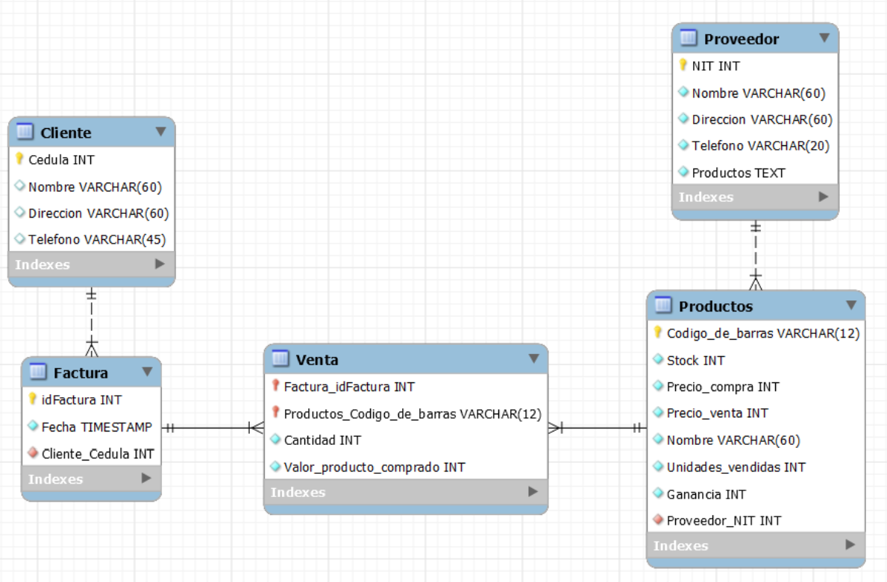

<div align="center">

# Aplicación de supermercado
  
</div>

***

Esta es una aplicación web que permite administrar el inventario y las ventas de un supermercado. Las herramientas que hemos usado para el desarrollo de esta aplicación fueron las siguientes: 

- MySQL.
- MongoDB.
- Django.
- HTML.
- Bootstrap.

## Contenido
- [Uso](Readme.md)
- [Base de datos](Readme.md)
    - [MySQL](Readme.md)
    - [MongoDB](Readme.md)
    - [Configuración de la base de datos](Readme.md)
- [Autores](Readme.md)

## Uso

Para poder utilizar esta aplicación, se deben de seguir los siguientes pasos:

1. Clonar el repositorio.
    ```
    git clone -b mongodb https://github.com/JuanM0412/supermarket-app.git
    ```
2. Crear un ambiente virtual para poder instalar las dependencias.
    - Python:
      ```
      python -m venv venvname
      ```
    - Conda:
      ```
      conda create --name venvname
      ```

3. Instalar las dependencias.
    ```
    pip install -r requirements.txt
    ```

    **Nota:** Debe de tener en cuenta qué base de datos va a utilizar, en este repositorio va a encontrar las dependencias para usar MySQL y MongoBD, cada base de datos tiene su propia rama, por lo que debe de tener esto en cuenta. Esto se explica mejor [acá](Readme.md).

4. Cambiar las configuraciones de la base de datos en el archivo `settings.py`. Este se encuentra dentro de la carpeta `supermarket_manager`. Para este paso es mejor que [leas esto](Readme.md).

## Base de datos
### MySQL

#### Historia de Usuario
Un supermercado tiene un sistema de gestión donde almacena la información de sus productos y proveedores que ofrecen dichos productos, pero también, la información de compras realizadas en el establecimiento y los datos de los clientes que las realizaron.

De cada producto se almacenan los datos de: código de barras producto, ganancia por producto, NIT proveedor del producto, nombre producto, precio compra producto, precio venta producto, stock producto, unidades vendidas producto. Dicho apartado está estrechamente relacionado con la información de los proveedores, es más, se tiene en el sistema que un proveedor ofrece muchos productos. De los proveedores se guardan los datos de: conjunto de productos ofrecidos, dirección proveedor, NIT proveedor, nombre proveedor, teléfono proveedor.

Por otra parte, tenemos el apartado de compras; cuando un cliente se dirige a la caja registradora con un conjunto de productos, lo primero que hace la persona que le atiende es preguntar si desea registrarse en el sistema si el cliente no lo está, para así ser partícipe de múltiples ofertas e información que el supermercado le desea compartir, de hecho, dicho servicio puede ser acompañado hasta por domicilios. En caso de que el cliente acceda a registrarse, se le pide su nombre, Cédula, dirección de residencia y número telefónico. Si por el contrario decide que no lo hará, solo se le pide su cédula.

Durante la venta se registran los productos y se hace el proceso de facturación, proceso que puede finalizar con una factura física o digital según lo decida el cliente. La factura viene dividida en 2 partes, siendo la primera aquella que contiene la información del establecimiento y del cliente (dirección supermercado, fecha factura, NIT supermercado, nombre supermercado, identificación factura) y la segunda, el cuerpo de la factura (conjunto de productos seleccionados por el cliente, identificación 
factura, valor total compra).

Cabe resaltar que como los productos están registrados como un grupo de artículos identificados con el mismo código de barras, se da que muchos productos (en este caso, artículos de ese conjunto), estén relacionados con muchas facturas. Para solucionar ese inconveniente, se decide que el sistema relacione el código de barras de un artículo que esté comprando el cliente, con la identificación de la factura.

Al finalizar el proceso de compra, se le entregan los productos al cliente y la respectiva factura.

#### Modelo
Para la construcción de la base de datos, teniendo en cuenta la [historia de usuario](Readme.md), se utilizó el siguiente modelo.
<div align="center">
  
</div>
La implementación de este modelo en Django se puede encontrar en los siguientes archivos:

  - `apps/cajero/models.py`
  - `apps/administrador/models.py`

### MongoDB

### Configuración de la base de datos

## Autores

* ***[Juan Manuel Gómez](https://github.com/JuanM0412)***
* ***[Miguel Ángel Hoyos](https://github.com/miguelhoyosve)***
* ***[Santiago Neusa](https://github.com/sneusar)***
