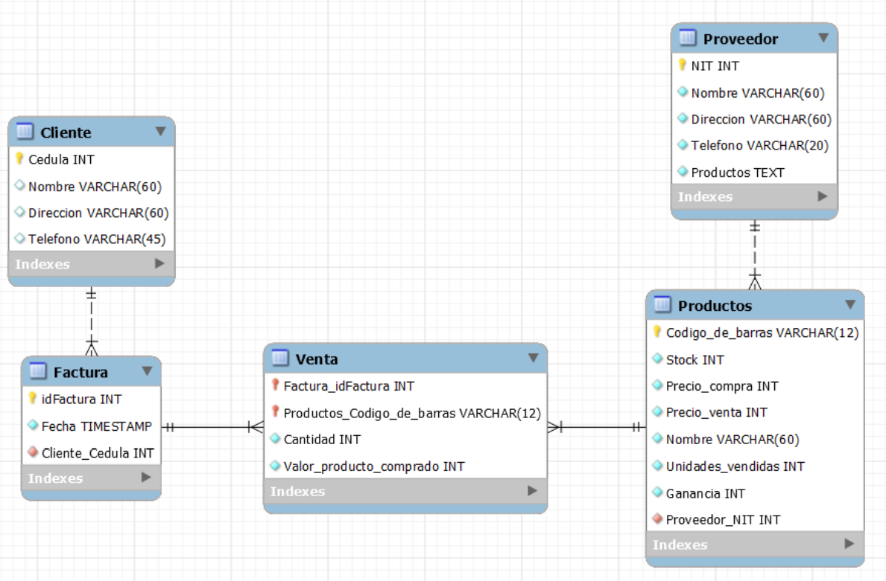

<div align="center">

# Aplicación de supermercado
  
</div>

***

Esta es una aplicación web que permite administrar el inventario y las ventas de un supermercado. Las herramientas que hemos usado para el desarrollo de esta aplicación fueron las siguientes: 

- MySQL.
- MongoDB.
- Django.
- HTML.
- Bootstrap.

## Contenido
- [Uso](Readme.md)
- [Base de datos](Readme.md)
    - [MySQL](Readme.md)
    - [MongoDB](Readme.md)
    - [Configuración de la base de datos](Readme.md)
- [Autores](Readme.md)

## Uso

Para poder utilizar esta aplicación, se deben de seguir los siguientes pasos:

1. Clonar el repositorio.
    ```
    git clone https://github.com/JuanM0412/supermarket-app.git
    ```
2. Crear un ambiente virtual para poder instalar las dependencias.
    - Python:
      ```
      python -m venv venvname
      ```
    - Conda:
      ```
      conda create --name venvname
      ```

3. Instalar las dependencias.
    ```
    pip install -r requirements.txt
    ```

    **Nota:** Debe de tener en cuenta qué base de datos va a utilizar, en este repositorio va a encontrar las dependencias para usar MySQL y MongoBD, cada base de datos tiene su propia rama, por lo que debe de tener esto en cuenta. Esto se explica mejor [acá](Readme.md).

4. Cambiar las configuraciones de la base de datos en el archivo `settings.py`. Este se encuentra dentro de la carpeta `supermarket_manager`. Para este paso es mejor que [leas esto](Readme.md).

## Base de datos
### MySQL

#### Modelo
Para la construcción de la base de datos, se utilizó el siguiente modelo.
<div align="center">
  
</div>
La implementación de este modelo en Django se puede encontrar en los siguientes archivos:

  - `apps/cajero/models.py`
  - `apps/administrador/models.py`

### MongoDB
### Configuración de la base de datos

## Autores

* ***[Juan Manuel Gómez](https://github.com/JuanM0412)***
* ***[Miguel Ángel Hoyos](https://github.com/miguelhoyosve)***
* ***[Santiago Neusa](https://github.com/sneusar)***
